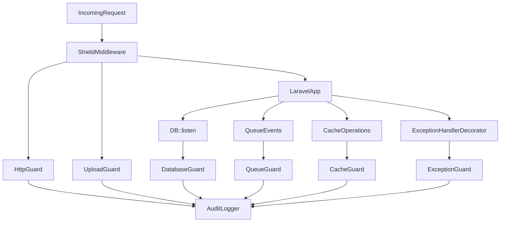

# Laravel Shield

> Runtime security layer for Laravel applications (MIT, fully open source).

Laravel Shield provides in-app runtime protection for Laravel: request inspection, upload hardening, SQL/query monitoring, queue/auth/cache/tenant safeguards, exception intelligence, audit logging, and operational security tooling.

Shield persists two complementary streams:
- `shield_audit_logs` for immutable audit events
- `shield_threat_logs` for normalized actionable threat records with stable fingerprints

---

## Why Laravel Shield

Traditional controls (validation-only rules or perimeter filters) often miss runtime-context attacks. Shield runs inside Laravel's execution flow, where it can use request, auth, DB, queue, and tenant context together.

### Core design principles

- Framework-safe integration (`ServiceProvider`, middleware, events, `DB::listen`)
- Fail-safe behavior for guard/event/audit paths
- Guard-based architecture with global and per-guard modes
- Bounded synchronous checks with optional async analysis
- Structured audit logging with pluggable drivers

---

## Security Coverage

| Area | Guard / Component | Capability |
|---|---|---|
| HTTP | `HttpGuard` | Payload/header anomaly checks, request scoring |
| Database | `DatabaseGuard` | SQL anomaly checks, raw query detection, slow query flagging |
| Uploads | `UploadGuard` | Extension/MIME/magic-byte checks, content scanning, archive inspection |
| Queue | `QueueGuard` | Payload inspection, allow/block lists, failed-job pattern analysis |
| Auth | `AuthGuard` | Brute-force and session anomaly heuristics |
| Cache | `CacheGuard` | Key validation, serialization-risk checks, size anomaly checks |
| Tenant | `TenantGuard` | Tenant isolation checks with configurable resolver |
| Exceptions | `ExceptionGuard` | Sensitive-data scrubbing and anomaly classification |
| Policy | `PolicyEngine` | Runtime rule evaluation |
| Audit | `AuditLogger` | Structured event logging (`database`, `log`, `null`) |
| Intelligence | `IntelligenceClient` | Optional external intelligence integration |

---

## Installation

```bash
composer require vendor-shield/laravel-shield
```

### Install package assets

```bash
php artisan shield:install
```

`shield:install` can:
- publish `config/shield.php`
- run package migrations
- create Shield storage directories for upload workflows

---

## Quick Start

### 1) Verify health

```bash
php artisan shield:health
```

### 2) Start safely in monitor mode

```env
SHIELD_MODE=monitor
```

### 3) Enforce high-value guards after tuning

```env
SHIELD_HTTP_MODE=enforce
SHIELD_UPLOAD_MODE=enforce
SHIELD_DB_MODE=monitor
```

---

## Runtime Modes

| Mode | Behavior |
|---|---|
| `enforce` | Actively block/reject suspicious activity |
| `monitor` | Observe and log without blocking |
| `learning` | Capture behavior for baseline tuning |
| `disabled` | Guard is inactive |

Global mode:

```env
SHIELD_MODE=monitor
```

Per-guard override example:

```env
SHIELD_UPLOAD_MODE=enforce
SHIELD_QUEUE_GUARD_MODE=monitor
```

---

## Commands

| Command | Description |
|---|---|
| `php artisan shield:install` | Publish config, run migrations, create storage directories |
| `php artisan shield:health` | Report runtime, guards, DB, storage, and intelligence status |
| `php artisan shield:baseline` | Generate JSON baseline snapshot |
| `php artisan shield:runtime:enable` | Toggle Shield globally or specific guard via `.env` |
| `php artisan shield:compliance-report` | Generate experimental SOC2 / ISO27001 / GDPR report |

Examples:

```bash
php artisan shield:baseline --output=storage/shield/baseline.json
php artisan shield:runtime:enable --guard=upload
php artisan shield:runtime:enable --disable --guard=tenant
php artisan shield:compliance-report --type=soc2 --from=2026-01-01 --to=2026-01-31
```

---

## Configuration

Primary file: `config/shield.php`

### Global controls

```php
'enabled' => env('SHIELD_ENABLED', true),
'mode' => env('SHIELD_MODE', 'monitor'),
```

### Upload hardening highlights

```php
'guards' => [
    'upload' => [
        'max_file_size' => env('SHIELD_UPLOAD_MAX_SIZE', 52428800),
        'compare_client_mime' => env('SHIELD_UPLOAD_COMPARE_CLIENT_MIME', true),
        'block_archives' => env('SHIELD_UPLOAD_BLOCK_ARCHIVES', true),
        'full_content_scan' => env('SHIELD_UPLOAD_FULL_SCAN', true),
        'polyglot_detection' => env('SHIELD_UPLOAD_POLYGLOT_DETECT', true),
    ],
],
```

### Audit driver

```env
SHIELD_AUDIT_DRIVER=database
# or: log, null
```

### Threat driver

```env
SHIELD_THREATS_DRIVER=database
# or: log, null
```

---

## Architecture Overview



---

## Production Rollout

### Phase 1: Observe
- keep `SHIELD_MODE=monitor`
- inspect audit output and guard noise

### Phase 2: Selective enforcement
- enable `enforce` for HTTP + Upload first
- keep DB/Queue/Auth/Cache in monitor while tuning

### Phase 3: Broaden enforcement
- progressively enable enforcement by guard
- retain rollback path (`shield:runtime:enable --disable --guard=...`)

---

## Testing and Quality

```bash
composer lint
composer analyse
composer test
```

---

## Security Boundaries

Shield improves runtime security posture, but does not replace:
- infrastructure firewalls / CDN security controls
- secure coding and code review practices
- malware sandbox/CDR systems for high-risk upload pipelines
- business-specific authorization design

Use Shield as one layer in defense-in-depth.

---

## Compatibility

| Component | Supported |
|---|---|
| PHP | `^8.2` |
| Laravel | `11.x`, `12.x` |
| Contexts | HTTP, CLI, queue workers |

---

## Open Source

- License: MIT
- No feature tiers
- No license key required

---

## Author

- Rajat Kumar Jha
- RCV Technologies

---

## Contributing

Contributions are welcome. Include:
- tests for behavior changes
- docs updates for config/command/public API updates
- migration notes when behavior is changed

Contributor docs:
- `CONTRIBUTING.md`
- `SECURITY.md`
- `CHANGELOG.md`

Recommended local workflow:

```bash
composer install
composer lint
composer analyse
composer test
```
